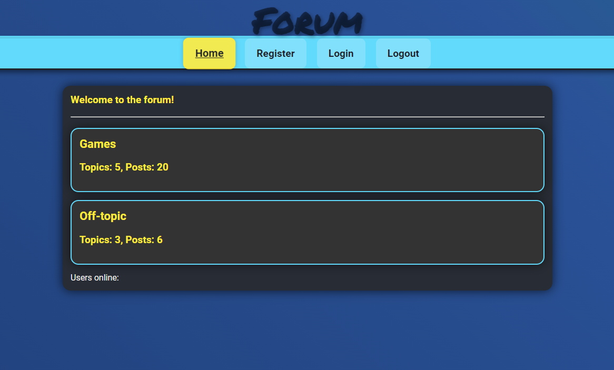
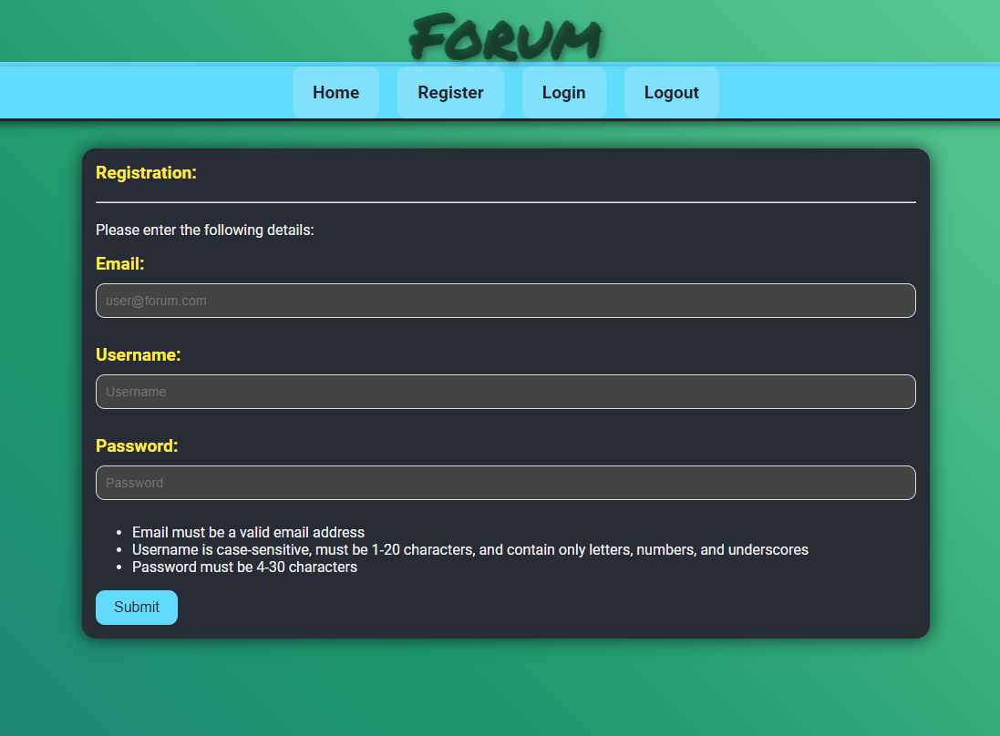
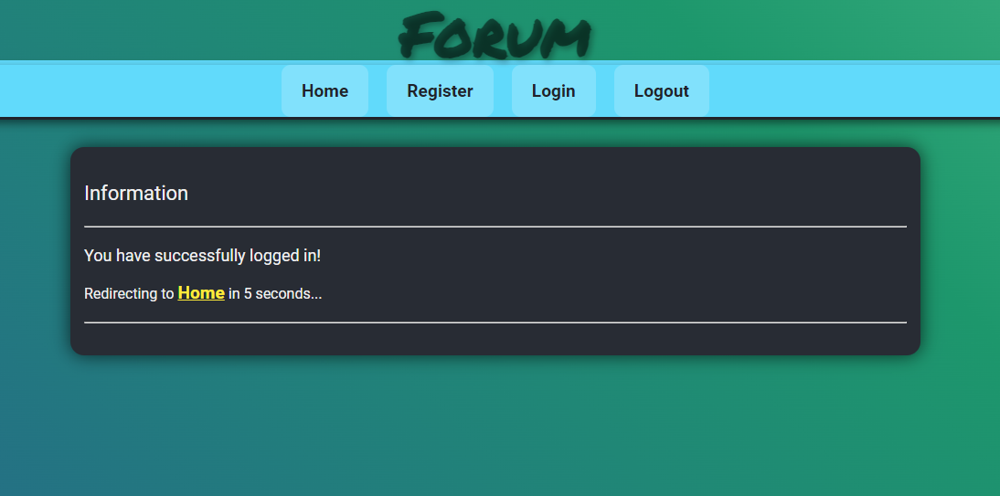
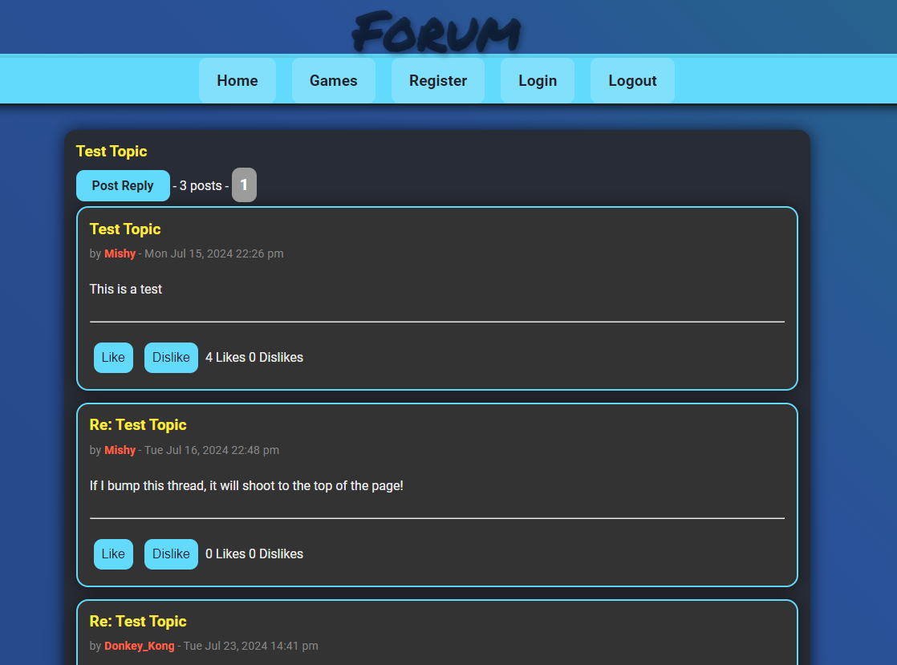

# forum

## Description

This project is a forum designed in Golang that allows users to register, login and create posts. All users are able to view content on the forum, but only authenticated users are allowed to create topics and posts. Authenticated users are also able to like/dislike posts and comments, making use of Javascript. Users can filter posts by various categories, including their own posts and posts they've liked if they're authenticated. For more details on the implementation, see below.

## Usage: how to run

Simply run the program like so to start the server:

```sh
go run .
```

Then visit `localhost:8080` on your device. From the main page, you can navigate through the subforums (their respective topics and posts). In the navigation bar at the top, you can register, login and logout (if logged in!). Example images below:






## Running via Dockerfile

Create the docker image as follows:
```sh
docker image build -f dockerfile -t forum-docker .
```

Then run a container from the image (on port 8080):
```sh
docker container run -p 8080:8080 --detach --name forum forum-docker
```

## Implementation

- The web server is written in Go and has handlers for each of its web pages
- Makes use of an sqlite database as the backbone for storing and retrieving data to be displayed on each of its pages
- The server can create a database and execute schema to create and populate tables
- The server makes use of UUID to generate session IDs for logged in users, and includes it in a cookie for the client
- The sessions are also stored and edited on the server-side safely using Mutex
- A Go routine is used to concurrently check for expired sessions on the server-side
- Cookies and sessions are deleted upon logout
- The server checks whether users are authenticated for certain actions, allowing/disallowing users accordingly
- All forms (registration, logging in, posting) submit POST requests with indivdual handlers to insert and update tables in the database accordingly
- Passwords are stored in the database after being encrypted with bcrypt
- Javascript was not a requirement for the project, but was determined to be beneficial in fulfilling the requirement to implement a like/dislike system
- All errors are funnelled through an error handler and displayed on an information page

## Authors

This program was written by Jez Godfrey as part of the 01 Founders fellowship
